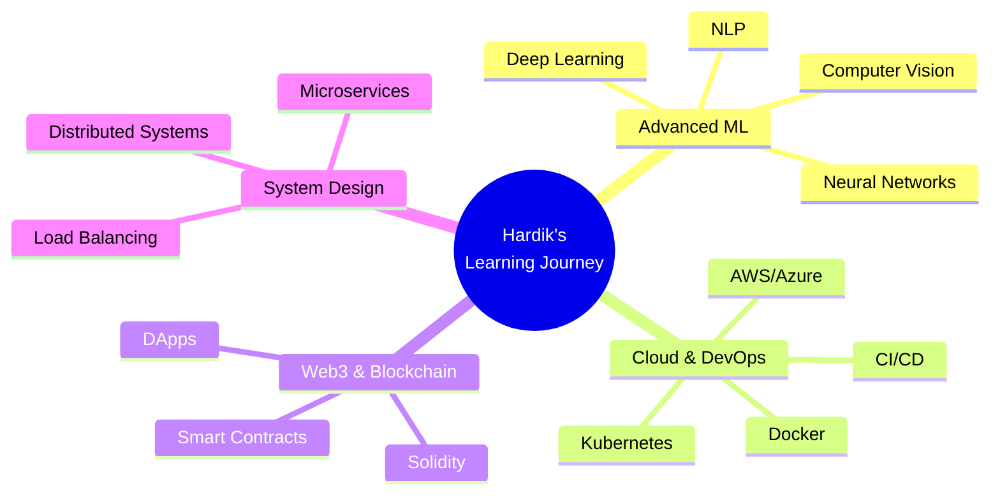
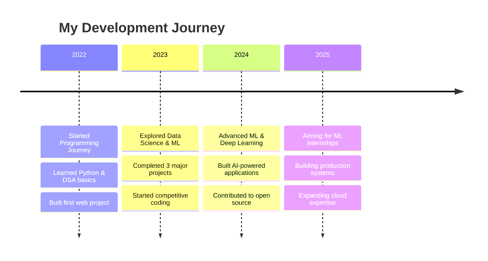

<div align="center">

```
╦ ╦╔═╗╦═╗╔╦╗╦╦╔═  ╔═╗╦ ╦╔═╗╦ ╦╔╦╗╦ ╦╔═╗╦═╗╦ ╦
╠═╣╠═╣╠╦╝ ║║║╠╩╗  ║  ╠═╣║ ║║ ║ ║║╠═╣╠═╣╠╦╝╚╦╝
╩ ╩╩ ╩╩╚══╩╝╩╩ ╩  ╚═╝╩ ╩╚═╝╚═╝═╩╝╩ ╩╩ ╩╩╚═ ╩ 
```


[](https://github.com/Har-dik25)
[](https://github.com/Har-dik25)
[](https://github.com/Har-dik25)

</div>

---

## 🔥 About Me

```typescript
const hardik = {
    pronouns: "He" | "Him",
    currentStatus: "3rd Year B.Tech Student 🎓",
    specialization: ["AI & Data Engineering", "Machine Learning", "Full Stack Development"],
    location: "Phagwara, Punjab, IN 📍",
    passions: ["Building Scalable Solutions", "Data Science", "Open Source"],
    funFact: "I binge-watch web series & movies while debugging code 🎬",
    lifeGoals: ["Land an amazing ML Engineering internship", "Contribute to major OSS projects", "Build products that impact millions"],
    availableFor: "Internships, Freelance Projects, and Collaborations"
};
```

<div align="center">

### 🌟 *"Transforming ideas into intelligent solutions, one line of code at a time."*

</div>

---

## 🛠️ Tech Stack & Tools

<div align="center">

### 💻 Languages


### 🤖 AI/ML & Data Science


### 📊 Data Tools


### 🚀 Frameworks & Libraries


### 🔧 Tools & Platforms


</div>

---

## 📌 Featured Projects

<table align="center">
<tr>
<td width="50%" valign="top">

### 🏦 [Loan Data Analysis](https://github.com/Har-dik25)
*Advanced data analytics for loan approval prediction*

**Tech:** Python, Pandas, Matplotlib, Machine Learning  
**Features:**
- 📊 Comprehensive EDA with 15+ visualizations
- 🤖 ML model with 92% accuracy
- 📈 Interactive Power BI dashboard
- 🔍 Risk assessment automation

[](https://github.com/Har-dik25)

</td>
<td width="50%" valign="top">

### 🚦 [AI Traffic Congestion Analysis](https://github.com/Har-dik25)
*Smart traffic management using computer vision*

**Tech:** Python, OpenCV, TensorFlow, YOLOv5  
**Features:**
- 🎥 Real-time vehicle detection
- 🧠 Congestion prediction algorithm
- 📉 Traffic flow optimization
- 🗺️ Heat map generation

[](https://github.com/Har-dik25)

</td>
</tr>

<tr>
<td width="50%" valign="top">

### ⚖️ [LegalLens AI](https://github.com/Har-dik25)
*AI-powered legal document analyzer*

**Tech:** Python, NLP, spaCy, Flask  
**Features:**
- 📄 Document clause extraction
- 🔍 Risk assessment analysis
- 💼 Legal jargon simplification
- ⚡ 10x faster than manual review

[](https://github.com/Har-dik25)

</td>
<td width="50%" valign="top">

### 🏨 [OYO Clone App](https://github.com/Har-dik25)
*Full-stack hotel booking platform*

**Tech:** HTML, CSS, JavaScript, Node.js  
**Features:**
- 🔐 User authentication system
- 🔎 Advanced search & filters
- 💳 Booking management
- 📱 Fully responsive design

[](https://github.com/Har-dik25)

</td>
</tr>

<tr>
<td width="50%" valign="top">

### 📓 [Personal Diary App](https://github.com/Har-dik25)
*Secure digital diary with encryption*

**Tech:** Python, Tkinter, SQLite  
**Features:**
- 🔒 AES-256 encryption
- 🏷️ Tag-based organization
- 🔍 Full-text search
- 🎨 Custom themes

[](https://github.com/Har-dik25)

</td>
<td width="50%" valign="top">

### 🌐 [P2P Network Simulation](https://github.com/Har-dik25)
*Decentralized network architecture*

**Tech:** Python, Socket Programming  
**Features:**
- 🔗 Peer discovery protocol
- 📦 File sharing mechanism
- 🛡️ Encryption layer
- 📊 Network topology visualization

[](https://github.com/Har-dik25)

</td>
</tr>
</table>

---

## 📊 GitHub Statistics

<div align="center">


### 🐍 Contribution Snake


### 💬 Daily Dev Quote

<!--QUOTE:START-->
*Loading inspiring quote...*
<!--QUOTE:END-->

</div>

---

## 🧠 Currently Learning & Exploring

<div align="center">



</div>

**🎯 Current Focus Areas:**
- 🧠 Advanced Deep Learning & Transformers
- ☁️ AWS Certified Machine Learning Specialty
- 🎨 Building end-to-end ML pipelines
- 🔗 Contributing to Open Source ML projects
- 📚 Reading: "Designing Data-Intensive Applications"

---

## 🏆 Achievements & Milestones

<div align="center">

| 🎯 Milestone | 📅 Year | 🏅 Achievement |
|-------------|---------|----------------|
| 🚀 Projects | 2024 | Built 10+ real-world projects |
| 💻 DSA | 2024 | Solved 200+ coding problems |
| 📊 Data Analytics | 2023 | Created 5 Power BI dashboards |
| 🤖 ML Models | 2024 | Deployed 3 production models |
| 🎓 Academic | 2023 | Maintained 8.5+ CGPA |

</div>

---

## 🌐 Connect With Me

<div align="center">

[](https://www.linkedin.com/in/hardik2583/)
[](https://github.com/Har-dik25)
[](mailto:hardik2583@gmail.com)
[](https://github.com/Har-dik25)
[](https://twitter.com/)
[](https://leetcode.com/)

</div>

---

## 💡 Fun Facts & Interests

<div align="center">

| 🎬 | 🎮 | 📚 | ⚡ |
|---|---|---|---|
| Netflix Binger | Tech Explorer | Avid Learner | Problem Solver |
| Web Series Fan | Coding Enthusiast | AI Researcher | Coffee Lover |

</div>

---

## 🎯 Future Goals & Vision

<div align="center">

```ascii
┌─────────────────────────────────────────────────────────┐
│  🚀 2025 ROADMAP                                        │
├─────────────────────────────────────────────────────────┤
│  ✅ Build 5 production-ready ML projects               │
│  ✅ Contribute to 3+ major open-source projects        │
│  ✅ Land a dream ML Engineering internship             │
│  ✅ Publish research paper in AI/ML domain             │
│  ✅ Master cloud computing (AWS/GCP)                   │
│  ✅ Build a SaaS product that reaches 10K users        │
└─────────────────────────────────────────────────────────┘
```

</div>

**🌟 Long-term Vision:**
- Become a Senior ML Engineer at a top tech company
- Contribute to cutting-edge AI research
- Build products that solve real-world problems
- Mentor aspiring developers and data scientists

---

## 🎨 Skills Cloud

<div align="center">

```
              🐍 Python                    ⚛️ React
        
    📊 Data Science            🤖 Machine Learning
    
              💾 SQL                    🎨 Frontend
        
    🧠 Deep Learning           ☁️ Cloud Computing
    
              🔧 Git                    🚀 DevOps
```

</div>

---

## 📈 My Learning Journey Timeline



---

<div align="center">

### 🌈 *"Code is like humor. When you have to explain it, it's bad."* – Cory House

[](https://github.com/piyushsuthar/github-readme-quotes)

---

### 💖 Thanks for visiting! Let's build something amazing together! 🚀


</div>